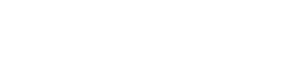

```{r setup, include=FALSE}

all_times <- list() # store the time for each chunk
knitr::knit_hooks$set(time_it = local({
  now <- NULL
  function(before, options) {
    if (before) {
      now <<- Sys.time()
    } else {
      res <- difftime(Sys.time(), now, units = "secs")
      all_times[[options$label]] <<- res
    }
  }
}))

knitr::opts_chunk$set(
  tidy = TRUE,
  tidy.opts = list(width.cutoff = 95),
  message = FALSE,
  warning = FALSE,
  time_it = TRUE,
  error = TRUE,
  echo = TRUE,
  engine.opts = list(bash = "-l")
)
```

```{r libraries}

library(Seurat)
```

# Testing similarity between cell groups.

To implement the similarity score method, we would calculate a score that quantifies the resemblance between the gene expression profile of each AT and NAT cell and the average profile of T cells. A common similarity measure is the cosine similarity. Here's a step-by-step guide on how we will to implement this using R and the Seurat package:

1.  Calculus of the Average Expression Profile for T group: First, we need to calculate the average expression profile for the T group. This will serve as the reference profile to which we will compare the AT cells.
2.  Normalization and data scaling: We will ensure that our data is normalized and scaled appropriately to allow for meaningful comparisons between cells.
3.  Calculus of the Similarity Scores: For each AT cell, calculate the similarity score with the average T cell profile using cosine similarity.
4.  Interpretation of the Scores: Higher similarity scores indicate a closer resemblance to the T group profile. We will set a threshold to determine which cells are considered similar to T cells.

The cosine method creates a vector with the expression values of the cells, represents it on a inner product space, calculates the cosine of the angle between the vectors and takes it as a measure of their similarity.

```{r load_processed_data}

SCP_data <- readRDS(file = "~/Documents/SC_Prostate/Data/SC_Prostate_processed.rds")
```

For this purpose, we will create a function that calculates the cosine similarity of two vectors.

The formula for the cosine similarity calculation based on the Euclidean dot product of two vectors is:



The implementation for this in R would be:

```{r cosine_func}

# Function to calculate cosine similarity.
cosine_similarity <- function(A, B) {
  sum(A * B) / (sqrt(sum(A^2)) * sqrt(sum(B^2)))
}
```

We then create a function to access the data in a SeuratObject and calculate the similarity score in three ways, per-cell, per-sample or per-group.

This functions calculates the average expression vector for the specified reference group and compares a target group against it in a per-cell, per-sample or per-group approach.

The function returns a named vector with the similarity score for each cell/sample or the whole group for the specified target. If the selected mode is "all" it would get the similarity score for all the cells in the dataset.

We also add the possibility to perform Pearson, Kendall or Spearman correlation tests with the method argument (default is cosine similarity)

```{r SC_similarity}

SC_similarity <- function(
    seurat_object, mode, target, reference, method = "cosine"
    ) {
  
  mode = tolower(mode)
  target = toupper(target)
  method = tolower(method)
  
  # Calculate average expression of the reference group.
  ref_group <- subset(seurat_object, Sample_Group == reference)
  ref_group_avg <- AverageExpression(ref_group, assay = "SCT", slot = "scale.data")
  
  # Get target cells.
  target_cells <- subset(seurat_object, Sample_Group == target)
  
  if (mode == "cell") {
    
    # Extract the scaled data for similarity calculations.
    data_matrix <- GetAssayData(target_cells, assay = "SCT", slot = "scale.data")

  # Calculate similarity scores for all cells.
  
    if (method == "cosine") {
  
      similarity_scores <- apply(data_matrix, 2, function(cell_expression) {
        cosine_similarity(cell_expression, ref_group_avg$SCT[,1])
        })
      
    } else {
      
      similarity_scores <- apply(data_matrix, 2, function(cell_expression) {
        cor(cell_expression, ref_group_avg$SCT[,1], method = method)
        })
      
    }

  }
  
  if (mode == "sample") {
    
    similarity_scores = list()
    
    # Loop over each unique sample name to calculate similarity scores
    for (sample in unique(target_cells$Sample_Name)) {
      
      # Subset Seurat object for cells from the current sample
      sample_cells <- subset(target_cells, Sample_Name == sample)
      
      # Aggregate the expression data for the current sample
      sample_avg_expression <- AverageExpression(sample_cells, assay = "SCT", slot = "scale.data")
      
      # Calculate cosine similarity with the T cell average expression
      
      if (method == "cosine") {
        
        similarity_scores[sample] <- cosine_similarity(
          sample_avg_expression$SCT[,1], ref_group_avg$SCT[,1]
          )
        
      } else {
        
        similarity_scores[sample] <- cor(
          sample_avg_expression$SCT[,1], ref_group_avg$SCT[,1], method = method
          )
        
      }
      
    }
    
    similarity_scores <- unlist(similarity_scores)
    
  }
  
  if (mode == "group") {
    
    similarity_scores = list()
    
    # Aggregate the expression data for the current sample
    target_group_avg <- AverageExpression(target_cells, assay = "SCT", slot = "scale.data")
    
    if (method == "cosine") {
      
      # Calculate cosine similarity with the T cell average expression
      similarity_scores[target] <- cosine_similarity(
        target_group_avg$SCT[,1], ref_group_avg$SCT[,1]
        )
      
    } else {
      
      # Calculate cosine similarity with the T cell average expression
      similarity_scores[target] <- cor(
        target_group_avg$SCT[,1], ref_group_avg$SCT[,1], method = method
        )
      
    }
  
  }
    
    similarity_scores <- unlist(similarity_scores)
    
  if (mode == "all") {
    
    # Extract the scaled data for similarity calculations.
    data_matrix <- GetAssayData(seurat_object, assay = "SCT", slot = "scale.data")
  
    # Calculate similarity scores for all cells.
      
    if(method == "cosine") {
  
      similarity_scores <- apply(data_matrix, 2, function(cell_expression) {
        cosine_similarity(cell_expression, ref_group_avg$SCT[,1])
        })
    } else {
      
      similarity_scores <- apply(data_matrix, 2, function(cell_expression) {
        cor(cell_expression, ref_group_avg$SCT[,1], method = method)
        })
    
    }
    
  }
    
  return(similarity_scores)
  
}
```

## A. Cosine similarity calculation per cell.

We consider a threshold of an 80% similarity enough for a dataset to be considered tumoral.

Using this approach no cell meets the requirements.

```{r filter_cells}

similarity_scores_AT <- SC_similarity(SCP_data, mode = "cell", target = "AT", reference = "T")

# We set a threshold of similarity.
threshold <- 0.8
similar_cells_AT <- names(similarity_scores_AT[similarity_scores_AT > threshold])

length(similar_cells_AT)
```

## B. Cosine similarity calculation per sample.

When applied to the average of all samples, all AT samples are classified as tumoral.

```{r filter_samples}

similarity_scores_AT <- SC_similarity(SCP_data, mode = "sample", target = "AT", reference = "T")

# We set a threshold of similarity.
threshold <- 0.8
similar_groups_AT <- names(similarity_scores_AT[similarity_scores_AT > threshold])

length(similar_groups_AT)
```

## C. Cosine similarity calculation per group.

When we use the average of the whole group, everything looks right, till we also check the similarity with the N group...

```{r filter_groups}

similarity_scores_AT <- SC_similarity(SCP_data, mode = "group", target = "AT", reference = "T")

similarity_scores_AT
```

```{r N_group}

test_N <- SC_similarity(SCP_data, mode = "group", target = "AT", reference = "N")

test_N
```

Seems that heterogeneity of the biopsy composition creates too much noise for this method to be applicable. Actually, when we compare the T group vs the N group:

```{r T_vs_N}

TvsN <- SC_similarity(SCP_data, mode = "group", target = "T", reference = "N")

TvsN
```

Taking into account that we are studying patients at low-risk-stages and reduced aggressiveness of the tumor and the intrinsic heterogeneity of the samples, the use of cosine similarity is not an appropriate method for sample comparison.

Pearson correlation provides similar results:

```{r pearson_test}

TvsN <- SC_similarity(SCP_data, mode = "group", target = "T", reference = "N", method = "pearson")
TvsN
```

We plot the N vs T group average expression and stimate its correlation as an example.

```{r pearson_plot}

# Calculate average expression of the reference group.
ref_group <- subset(SCP_data, Sample_Group == "N")
ref_group_avg <- AverageExpression(ref_group, assay = "SCT", slot = "scale.data")
  
# Calculate average expression of the target group.
target_cells <- subset(SCP_data, Sample_Group == "T")
target_group_avg <- AverageExpression(target_cells, assay = "SCT", slot = "scale.data")
  
data <- data.frame(ref_group_avg$SCT[,1], target_group_avg$SCT[,1])
  
library("ggpubr")
ggscatter(data, x = "ref_group_avg.SCT...1.", y = "target_group_avg.SCT...1.",
          add = "reg.line", conf.int = TRUE, 
          cor.coef = TRUE, cor.method = "pearson",
          xlab = "N group average expression", ylab = "T group average expression")
```


